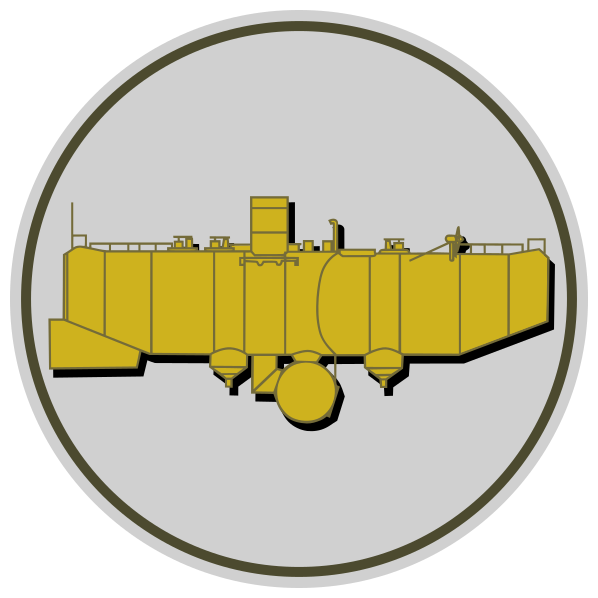

# Bathyscaphe

#### Deep immutability and thread-safety assessment for Java objects

 
The Bathyscaphe logo, a line drawing of <b><i>bathyscaphe Trieste</i></b> 
based on art found at <a href="https://bertrandpiccard.com/3-generations/jacques-piccard">bertrandpiccard.com</a> 

 

`SPDX-FileCopyrightText: © 2022, Michael Belivanakis, a.k.a. MikeNakis, michael.gr` 
`SPDX-License-Identifier: AGPL-3.0-only OR BATCL-1.0`

<!--- TODO: enable this when on maven central: 
      Maven Central badge /maven-central/v/:groupId/:artifactId?versionPrefix=29&versionSuffix=-android --->

<!--- TODO: enable these when they become non-zero -->
<!--- 

 
 
 --->

<!--- I am not sure what these are supposed to do --->
<!---  --->
<!---  --->
<!--- TODO: display jar file size --->
<!---  --->

<!--- TODO: none of these work, and the documentation is absolutely horrid. --->
<!--- 

 --->

<!--- TODO: for complicated stuff, see this post on how to generate README.md from a template: https://stackoverflow.com/a/69750410/773113 --->

<!--- GitHub fails to detect the license, so it always shows "not identifiable by github" ---> 
<!---  --->

<!--- Another example repository with dual license: https://github.com/evencart/evencart/blob/dev/LICENSE.txt --->
<!--- A repository with a couple of commercial license examples: https://github.com/evencart/evencart/blob/dev/LICENSE.txt
      (also with an example github yml that converts docx to pdf and commits back to the repository) --->

## Table of contents

- [Description](#description)
- [How it works](#how-it-works)
- [How to use](#usage)
    - [Asserting immutability](#usage-asserting-immutability)
        - [The objectMustBeImmutableAssertion() method](#usage-asserting-immutability-method)
    - [Adding pre-assessments](#usage-adding-pre-assessments)
        - [The addImmutablePreassessment() method](#usage-adding-pre-assessments-method)
    - [Annotating fields](#usage-annotating-fields)
        - [The @Invariable annotation](#usage-annotating-fields-invariable)
        - [The @InvariableArray annotation](#usage-annotating-fields-invariable-array)
    - [Self-assessment](#usage-self-assessment)
        - [The ImmutabilitySelfAssessable interface](#usage-self-assessment-interface)
    - [Obtaining diagnostics](#usage-obtaining-diagnostics)
        - [The explain() method](#usage-obtaining-diagnostics-method)
- [Status (Maturity) of the project](#maturity)
- [Installation](#installation)
- [Copyright](#copyright)
- [License](#license)
    - [Module bathyscaphe-claims: MIT license](#license-bathyscaphe-claims)
    - [Modules bathyscaphe and bathyscaphe-test: Dual license](#license-bathyscaphe)
        - [GNU Affero General Public License (GNUAGPL)](#license-bathyscaphe-agpl)
        - [Bathyscaphe Alternative Terms Commercial license (BATCL)](#license-bathyscaphe-commercial)
            - [Instructions for purchasing the Commercial License](#license-bathyscaphe-commercial-purchasing)
- [Contacting the author](#contact)
- [Glossary](#glossary)
- [Contributing](#contributing)
- [Code of Conduct](#code-of-conduct)
- [Sponsoring](#sponsoring)
- [Coding style](#coding-style)
- [Frequently Asked Questions](#faq)
- [Poor man's issue and TODO tracking](#issues)

## <a name="description">&ZeroWidthSpace;</a>Description

Bathyscaphe is an open-source java library that you can use to inspect objects at runtime and assert that they are immutable.

This document contains reference material about Bathyscaphe, assuming that you already understand what problem it solves, why it is a problem, why everyone has that problem, why it needs fixing, and why other tools fail to fix it. If not, please start by reading this article which introduces Bathyscaphe: [michael.gr - Bathyscaphe](https://blog.michael.gr/2022/05/bathyscaphe.html)

## <a name="how-it-works">&ZeroWidthSpace;</a>How it works

Bathyscaphe consists of the following modules:

1. **bathyscaphe-claims** contains annotations that you can add to your classes to guide assessment. Most client code is expected to make use of only this module of bathyscaphe.
1. **bathyscaphe** is the core immutability assessment library. A software system is likely to invoke this library only from a few places where immutability needs to be ascertained. For example, a custom `HashMap` class might contain a call to bathyscaphe, to assert that keys added to it are immutable.
1. **bathyscaphe-test** is, of course, the tests.

When assessing whether an object is immutable or not, Bathyscaphe begins by looking at the class of the object, and issues one of the following assessments:

1. Mutable
1. Immutable
1. Provisory

The first two are straightforward: if a class is conclusively assessed as mutable or immutable, then each instance of that class receives the same assessment, and we are done; however, if the class receives a provisory assessment, then Bathyscaphe proceeds to examine the content of the object.

For example, if a class looks immutable in all aspects except that it declares a final field of interface type, Bathyscaphe will recursively assess the actual value of that field.

Note that this yields consistently accurate assessments in cases where static analysis tools fail, because they only examine classes, so when a class contains a field which _might_ be mutable, they have no option but to err on the side of caution and assess the containing class as mutable.

## <a name="usage">&ZeroWidthSpace;</a>How to use

### <a name="usage-asserting-immutability">&ZeroWidthSpace;</a>Asserting immutability

- #### <a name="usage-asserting-immutability-method">&ZeroWidthSpace;</a>The `objectMustBeImmutableAssertion()` method

  The main thing you are likely to do with Bathyscaphe is this:

      assert Bathyscaphe.objectMustBeImmutableAssertion( myObject );  

  If `myObject` is immutable, this will succeed; otherwise, an `ObjectMustBeImmutableException` will be thrown.

  Note that the assertion statement itself will never fail, because `objectMustBeImmutableAssertion()` never returns `false`; It either returns `true`, or it throws `ObjectMustBeImmutableException`. The benefit of using the `assert` keyword is that the method will not be invoked unless assertions are enabled, which is how Bathyscaphe can boast zero performance overhead on production.

### <a name="usage-adding-pre-assessments">&ZeroWidthSpace;</a>Adding pre-assessments

- #### <a name="usage-adding-pre-assessments-method">&ZeroWidthSpace;</a>The `addImmutablePreassessment()` method

  Suppose that we have a class which is _effectively immutable_, meaning that it behaves immutably, but under the hood it is strictly speaking mutable, either because it is making use of lazy initialization, or simply because it contains an array. (Arrays in Java are mutable by nature.) If Bathyscaphe was to assess the immutability of this class, it would find it to be mutable; however, we know that the class behaves immutably, so we want to instruct Bathyscaphe to skip assessment and consider it as immutable. This is accomplished by adding what is known as a This "pre-assessment" or an "assessment override", as follows:

      Bathyscaphe.addImmutablePreassessment( EffectivelyImmutableClass.class );

  One famous effectively immutable class is `java.lang.String`, which contains both an array of characters and a lazily initialized hash-code field. Bathyscaphe has a built-in pre-assessment for `java.lang.String` and a few other well-known effectively immutable classes of the JDK.

Pre-assessment should be used only on classes whose source code we have no control over, such as classes found in the JDK or in third-party libraries. For classes that we write and can thus modify, see next section.

### <a name="usage-annotating-fields">&ZeroWidthSpace;</a>Annotating fields

If you write an effectively immutable class, you should use the annotations found in the `bathyscaphe-claims` module to annotate each effectively immutable field of that class, thus allowing Bathyscaphe to assess the immutability of the remaining fields and issue an assessment for your class as a whole.

- #### <a name="usage-annotating-fields-invariable">&ZeroWidthSpace;</a>The `@Invariable` annotation

  Suppose that we have a non-final field in an otherwise immutable class. The presence of such a field would normally cause Bathyscaphe to assess the declaring class as mutable; however, we know that this particular field will behave as if it was immutable, so we would like to tell Bathyscaphe to refrain from assessing that field, and consider it as immutable. This is accomplished as follows:

      @Invariable private int myLazilyInitializedHashCode;

  Thus, if the class meets all other requirements for immutability, Bathyscaphe will assess the class as immutable.

- #### <a name="usage-annotating-fields-invariable-array">&ZeroWidthSpace;</a>The `@InvariableArray` annotation

  Suppose that we have a field which is final, but it is of array type. Arrays are by definition mutable in Java, so the presence of this field would normally cause Bathyscaphe to assess the declaring class as mutable; however, we know that this particular field will behave as if it was immutable, so we would like to tell Bathyscaphe to refrain from assessing that field, and consider it as immutable. This is accomplished as follows:

      @InvariableArray private final byte[] mySha256Hash;

  Thus, if the class meets all other requirements for immutability, Bathyscaphe will assess the class as immutable.

Note that `@Invariable` and `@InvariableArray` can be combined.

Also note that it is illegal to use either of these annotations on non-private fields, because a class cannot give any promises about fields that may be mutated by other classes.

Also note that with these annotations we are only promising shallow immutability; Bathyscaphe will still perform all the checks necessary in order to guarantee deep immutability. So, for example, if the field was of type `Foo` instead of `int`, or if the array field was an array of `Foo` instead of an array of `byte`, then Bathyscaphe would recursively assess the immutability of `Foo` as part of assessing the immutability of the field.

### <a name="usage-self-assessment">&ZeroWidthSpace;</a>Self-assessment

- #### <a name="usage-self-assessment-interface">&ZeroWidthSpace;</a>The `ImmutabilitySelfAssessable` interface

  Sometimes, the question whether an object is mutable or immutable can be so complicated, that only the object itself can answer the question for sure. (For an example, see **_freezable class_** in the glossary.) In order to accommodate such cases, the bathyscaphe-claims module defines the `ImmutabilitySelfAssessable` interface. If your class implements this interface, bathyscaphe will be invoking instances of your class, asking them whether they are immutable or not. Here is an example:

      public class MyFreezableClass implements ImmutabilitySelfAssessable
      {
          private int mutable; private boolean frozen;
          public void mutate() { assert !frozen; mutable++; }
          public void freeze() { frozen = true; }
          @Override public boolean isImmutable() { return frozen; }
      }

### <a name="usage-obtaining-diagnostics">&ZeroWidthSpace;</a>Obtaining diagnostics

- #### <a name="usage-obtaining-diagnostics-method">&ZeroWidthSpace;</a>The `explain()` method

  Suppose that there is a certain object which we intended to be immutable, but Bathyscaphe finds it to be mutable. We would like to know exactly why Bathyscaphe issues this assessment, so that we can locate the problem and fix it. Here is how:

      Object myObject = List.of( new StringBuilder() );
      try
      {
          assert Bathyscaphe.objectMustBeImmutableAssertion( myObject ); 
      }
      catch( ObjectMustBeImmutableException e ) 
      {
          Bathyscaphe.explain( e ).forEach( System.out::println );
      }

  The above code will emit to the standard output a detailed human-readable diagnostic message explaining exactly why the assessment was issued. The text will look something like this: (Note: the exact text is subject to change.)

      ■ instance of 'java.util.ImmutableCollections.List12' is mutable because index 0 contains mutable instance of 'java.lang.StringBuilder'. (MutableComponentMutableObjectAssessment)
      ├─■ type 'java.util.ImmutableCollections.List12' is provisory because it is preassessed by default as a composite class. (CompositeProvisoryTypeAssessment)
      └─■ instance of 'java.lang.StringBuilder' is mutable because it is of a mutable class. (MutableClassMutableObjectAssessment)
        └─■ class 'java.lang.StringBuilder' is mutable because it extends mutable class 'java.lang.AbstractStringBuilder'. (MutableSuperclassMutableTypeAssessment)
          └─■ class 'java.lang.AbstractStringBuilder' is mutable due to multiple reasons. (MultiReasonMutableTypeAssessment)
            ├─■ class 'java.lang.AbstractStringBuilder' is mutable because field 'value' is mutable. (MutableFieldMutableTypeAssessment)
            │ └─■ field 'value' is mutable because it is not final, and it has not been annotated with @Invariable. (VariableMutableFieldAssessment)
            ├─■ class 'java.lang.AbstractStringBuilder' is mutable because field 'coder' is mutable. (MutableFieldMutableTypeAssessment)
            │ └─■ field 'coder' is mutable because it is not final, and it has not been annotated with @Invariable. (VariableMutableFieldAssessment)
            └─■ class 'java.lang.AbstractStringBuilder' is mutable because field 'count' is mutable. (MutableFieldMutableTypeAssessment)
              └─■ field 'count' is mutable because it is not final, and it has not been annotated with @Invariable. (VariableMutableFieldAssessment)

## <a name="maturity">&ZeroWidthSpace;</a>Status (maturity) of the project

The "Technology Readiness Level" (TRL) so-to-speak of Bathyscaphe currently is "5: Technology validated in lab".
- The library works, it appears to be problem-free, and it produces very good results; however, the only environment in which it is currently being put into use is the author's hobby projects, which is about as good as laboratory use.
- There is at least one major (but optional) feature pending to be implemented: thread-safety assessment.
- There is at least one major task pending to be done: publish on maven-central.  
- Since the project is still young, new releases are likely to contain breaking changes. (The major version number will always be incremented to indicate so.) 

## <a name="installation">&ZeroWidthSpace;</a>Installation

- In the near future, Bathyscaphe artifacts will be released to maven central, so you will not have to specify an artifact repository; however, for the time being, Bathyscaphe artifacts are not being released to maven central, and the situation is as follows:
	- Although the artifacts are being built on GitHub, and GitHub does store the artifacts, GitHub makes it difficult to use it as a maven artifact repository, or in any case I do not yet understand how to do that.
	- There appears to be a solution involving some jitpack.io, but I could not get it to work.
	- So, while I am figuring all this out, you can simply clone Bathyscaphe into your project, so that it builds along with your project, so your project has access to the artifacts.

## <a name="copyright">&ZeroWidthSpace;</a>Copyright

Copyright © 2022, Michael Belivanakis, a.k.a. MikeNakis, michael.gr

## <a name="license">&ZeroWidthSpace;</a>License
  
- ### <a name="license-bathyscaphe-claims">&ZeroWidthSpace;</a>Module `bathyscaphe-claims`: MIT license

    - The `bathyscaphe-claims` module is available under the **_MIT License_**, which is a very permissive open source license, allowing Bathyscaphe annotations to be freely used in any kind of code with minimal licensing concerns. See [Wikipedia: MIT License](https://en.wikipedia.org/wiki/MIT_License).

- ### <a name="license-bathyscaphe">&ZeroWidthSpace;</a>Modules `bathyscaphe` and `bathyscaphe-test`: Dual license

  The `bathyscaphe` and `bathyscaphe-test` modules of Bathyscaphe are available under a dual-license scheme. You can choose either the GNUAGPL v.3 license, or the BATCL v.1 license. If you take no action regarding licensing, the license that applies by default is the GNUAGPL.

    - #### <a name="license-bathyscaphe-agpl">&ZeroWidthSpace;</a>GNU Affero General Public License (GNUAGPL) v.3

      The GNUAGPL is a _viral_, _strong copyleft_ open-source license with an additional provision for _server-side software_. This means that any software making use of these modules must in turn be open-sourced under the same license, **_even if_** that software would not normally be distributed, as the case is, for example, with server-side software. See [Wikipedia: GNU Affero General Public License](https://en.wikipedia.org/wiki/GNU_Affero_General_Public_License).

    - #### <a name="license-bathyscaphe-commercial">&ZeroWidthSpace;</a>Bathyscaphe Alternative Terms Commercial license (BATCL) v.1

      The BATCL is a commercial license available for developers who want to use the `bathyscaphe` module and/or the `bathyscaphe-test` module without being bound by the GNUAGPL, because they do not want to have to publish their source code. The BATCL can be purchased from the author for a small fee. Payment is done simply and quickly, via PayPal.

        - #### <a name="license-bathyscaphe-commercial-purchasing">&ZeroWidthSpace;</a>Instructions for purchasing the Commercial License
            - Send money via PayPal
                - Recipient's e-mail address: paypal@michael.gr
                - Amount: 128.00
                - Currency: EUR
                - Payment reference ("What's this payment for?"): please enter the following information separated by spaces:
                    - Your e-mail address
                    - The name of the product you are purchasing a license for, i.e. "Bathyscaphe"
                    - The version number that you want to license, as it appears in the maven coordinates.
                - Your shipping address: make sure your legal address is selected.
            - As soon as we receive the fee, we will send you an acknowledgement.
            - As soon as you receive the acknowledgement, you are licensed.
            - If you fail to include your e-mail address, and something goes wrong with your request, we will not be able to contact you, so you will not be licensed, and any funds received will be considered donation.

- ### Disclaimer

  This software is distributed WITHOUT ANY WARRANTY; without even the implied warranty of
MERCHANTABILITY or FITNESS FOR A PARTICULAR PURPOSE. 

- ### Governing Law

  These licenses and any disputes arising hereunder shall be construed and governed by the laws of the Kingdom of The Netherlands regardless of otherwise applicable choice of law rules.

- ### Violations    

  If you have good reasons to believe that an organization or individual is using this software in ways which are not compliant with the GNU AGPL v.3, while at the same time they have not purchased a commercial license for the particular version of the software that they are using, please contact the author.

## <a name="contact">&ZeroWidthSpace;</a>Contacting the author

The author's e-mail address can be found on the sidebar of his blog: https://blog.michael.gr.

## <a name="glossary">&ZeroWidthSpace;</a>Glossary

Note: some of the glossary terms (i.e. **_variable_** / **_invariable_**, **_extensible_** / **_inextensible_**) are introduced in order to mitigate the ambiguities caused by Java's unfortunate decision to reuse certain language keywords (i.e. `final`) to mean entirely different things in different situations. (i.e. a `final` class vs. a `final` field.)

- **_Assertion Method_** - a pattern of my own devise, for writing comprehensive assertions.
	- An assertion method is identified by the suffix `Assertion` in its name.
	- An assertion method is only meant to be invoked from within an `assert` statement.
	- To prevent misuse, an assertion method should generally avoid returning `false` to indicate failure; instead, an assertion method should either return `true`, or throw an exception.
	- For clarity, if an assertion method checks one thing and throws one exception, then the exception should have the same name as the assertion method, only suffixed with `Exception` instead of `Assertion`.
		- From this it follows that exceptions should have assertive names, describing what is expected, such as `PointerMustBeNonNullException`, instead of declarative names, describing postmortem findings, such as `NullPointerException`. One day I will write an article explaining this in greater detail.

- **_Assessment_** - the result of examining an object or a class to determine whether it is immutable or not. Bathyscaphe contains a hierarchy of assessments, which is divided into a few distinct sub-hierarchies: one for type assessments, one for object assessments, one for field assessments, and one for field value assessments. These hierarchies all share a common ancestor for the sole purpose of constructing assessment trees, where the children of an assessment are the reasons due to which the assessment was issued. Also see **_Type assessment_**, **_Object assessment_**.

- **_Bathyscaphe_** - (/ˈbæθɪskeɪf/ or /ˈbæθɪskæf/) (noun) a free-diving, self-propelled, deep-sea submersible with a crew cabin. Being yellow is not a strict requirement. See [Wikipedia - Bathyscaphe](https://en.wikipedia.org/wiki/Bathyscaphe)

- **_Deep Immutability_** - the immutability of an entire object graph reachable from a certain object, as opposed to the immutability of only that object. It is among the fundamental premises of Bathyscaphe that this is the only type of immutability that really matters. Also see opposite: **_Superficial Immutability_**.

- **_Effectively Immutable_** - classes that behave in an immutable fashion, but under the hood are strictly speaking mutable, due to various reasons, for example because they perform lazy initialization, or because they contain arrays. (Arrays in Java are mutable by nature.) The most famous example of such a class is `java.lang.String`. Note that this definition differs from the one given in "Java Concurrency In Practice" section 3.5.4 "Effectively Immutable Objects", which is not really about objects, but rather about the **_treatment_** of objects: the book talks about situations where very mutable objects (for example `java.util.Date`) are being passed around between threads, but the threads refrain from mutating them, so all is good. This sounds like catastrophe waiting to happen, and Bathyscaphe exists precisely in order to prevent programmers from doing things like that.

- **_Extensible class_** - a class that may be sub-classed (extended.) Corresponds to the absence of the language keyword `final` in the class definition. Also see opposite: **_Inextensible Class_**.

- **_Freezable class_** - a class which begins its life as mutable, so that it can undergo complex initialization, and is at some moment instructed to freeze in-place, thus becoming immutable from that moment on. For more information see the relevant appendix in the introductory blog post: [michael.gr - Bathyscaphe](https://blog.michael.gr/2022/05/bathyscaphe.html)

- **_Inextensible Class_** - a class that may not be sub-classed (extended.) Corresponds to the presence of the language keyword `final` in the class definition. Also see opposite: **_Extensible Class_**.

- **_Invariable Field_** - a field that cannot be mutated. Corresponds to the presence of the language keyword `final` in the field definition. Note that invariability here refers only to the field itself, and is entirely without regards to whether the object referenced by the field is immutable or not. Also see opposite: **_Variable Field_**.

- **_Object Assessment_** - represents the result of examining an instance of a class (an object) to determine whether it is immutable or not. One of the fundamental premises of Bathyscaphe is that we must assess objects for immutability because quite often the assessment of types is inconclusive. Bathyscaphe has one assessment to express that an object is immutable, but an entire hierarchy of assessments for all the different ways in which an object can be mutable, so that it can provide diagnostics as to precisely why an object was assessed as mutable. Also see **_Assessment_**, **_Type Assessment_**.

- **_Shallow Immutability_** - see **_Superficial Immutability_**

- **_Superficial Immutability_** - refers to the immutability of a single object, without regards to the immutability of objects that it references. It is among the fundamental premises of Bathyscaphe that this type of immutability is largely inconsequential. Also see opposite: **_Deep Immutability_**.

- **_Type Assessment_** - represents the result of examining a class to determine whether it is immutable or not. One of the fundamental premises of Bathyscaphe is that type assessment is quite often inconclusive, in which case we must go one step further and assess the immutability of instances of that class. (Objects.) Bathyscaphe has a single assessment to express that a class is immutable, a hierarchy of assessments to represent all the different ways in which a class may be mutable, and another hierarchy of so-called "provisory" assessments to represent all the different ways in which a type eludes assessment, necessitating the further assessment of instances of that type. The information contained in type assessments provides explanations as to why that particular assessment was issued. Furthermore, the information contained in provisory assessments is used by Bathyscaphe as a guide in assessing the immutability of instances. Also see **_Assessment_**, **_Object Assessment_**.

- **_Variable Field_** - a field that is free to mutate. Corresponds to the absence of the language keyword `final` in the field definition. Also see opposite: **_Invariable Field_**.

## <a name="contributing">&ZeroWidthSpace;</a>Contributing
                        
Please see [CONTRIBUTING.md](CONTRIBUTING.md)

## <a name="code-of-conduct">&ZeroWidthSpace;</a>Code of Conduct
                        
Please see [CODE_OF_CONDUCT.md](CODE_OF_CONDUCT.md)

## <a name="sponsoring">&ZeroWidthSpace;</a>Sponsoring

- If you would like to fund me to continue developing Bathyscaphe, or if you would like to see a DotNet version of Bathyscaphe sooner rather than later, you can bestow me with large sums of money; that always helps.

- Sponsoring link: https://paypal.me/mikenakis

## <a name="coding-style">&ZeroWidthSpace;</a>Coding style

When I write code as part of a team of developers, I use the teams' coding style.  
But when I write code for myself, I use _**my very own™**_ coding style.
As a result, Bathyscaphe uses My Very Own™ Coding Style. 

More information: [michael.gr - My Very Own™ Coding Style](https://blog.michael.gr/2018/04/on-coding-style.html)

## <a name="faq">&ZeroWidthSpace;</a>Frequently Asked Questions (F.A.Q., FAQ)

- #### What are the dependencies of Bathyscaphe?
	- The `bathyscaphe-test` module necessarily depends on JUnit.
	- The `bathyscaphe` and `bathyscaphe-claims` modules do not depend on anything outside the Java Runtime Environment.
		- Let me repeat this: Bathyscaphe. Has. No. Dependencies. It depends on nothing. When you include Bathyscaphe JARs in a project, you are including those JARs and nothing else.

- #### How large are the Bathyscaphe JARs?
	- The `bathyscaphe-claims` module is microscopic, since it contains no code, only a few definitions.
	- The `bathyscaphe` module qualifies as very small, as its JAR file is of the order of 100 kilobytes.

- #### What is the performance overhead of using Bathyscaphe?
	- Bathyscaphe is _faster than lightning_: the performance overhead of using Bathyscaphe is **_zero_**.
		- That is because performance is only relevant on production environments; bathyscaphe is meant to be used via assertions, which are meant to be disabled on production, therefore Bathyscaphe is not meant to actually do any work on production.
		- On development environments, the speed of Bathyscaphe will depend on what you are assessing:
			- In the best case, when assessing an object of conclusively assessable class, Bathyscaphe will do a synchronized map lookup before it determines it is immutable.
			- In the worst case, when assessing an object of provisory class, Bathyscaphe will use reflection to traverse the entire object graph reachable via provisory fields, while keeping a lock on a synchronized map. The map lock could of course be optimized, but there is no need, because performance is largely irrelevant on development.

- #### Why are the tests in a separate module?
	- Because I have the habit of always placing the tests in a separate module. That's what I do. It's my thing. One day I will write an article explaining why I do this.
	- If you would like to work with Bathyscaphe, do not obtain the sources from maven, because this will give you the sources of each module separately; instead, clone the bathyscaphe repository from GitHub. This is a "monorepo" which contains all modules in one directory structure. with a parent pom.xml at the root. All you need to do then is point your IDE to the parent pom, and you will have all modules in your IDE.

- #### Why `assert objectMustBeImmutableAssertion( o )` instead of simply `assert !isMutable( o )`?
	- Because `isMutable()` would imply that the method returns either `true` or `false`, while this method works very differently: it never returns `false`; it either returns `true`, or throws an exception.

- #### Why does `objectMustBeImmutableAssertion()` throw an exception instead of returning `false` ?
	- Because the method must produce something more substantial than a boolean, so that you can obtain diagnostics from it. An exception is something from which you can obtain diagnostics.
	- The alternative would be to have the method somehow produce diagnostic text right before returning `false`, which would then raise other questions, like where to emit that text to. Needless to say, I would have found such behavior mighty annoying.

- #### Why throw an exception containing an assessment instead of returning the assessment?
	- Because if I was to return the assessment then I would have to make the entire assessment hierarchy public, (i.e. move it out of the "internal" package,) and that would severely impede the evolution of Bathyscaphe, since any change to the assessments would break code that makes use of Bathyscaphe. The assessment hierarchy might be moved out of the "internal" package a few years down the road, when Bathyscaphe becomes a very mature project.

- #### Why is the method called `objectMustBeImmutableAssertion()` instead of simply `objectMustBeImmutable()`?
	- The suffix `Assertion` indicates that this is an **_assertion method_**. (See glossary.)

- #### Why is the method called `objectMustBeImmutableAssertion()` instead of simply `mustBeImmutableAssertion()`?
	- Because this is an _assertion method_, (see glossary,) whose name must match the name of the exception that it throws, and the exception name could not begin with `MustBe`, it has to begin with `ObjectMustBe`, so the method is named accordingly.

- #### Why is the exception called `ObjectMustBeImmutableException` instead of simply `ObjectIsMutableException`?
	- Because this exception is thrown by the `objectMustBeImmutableAssertion()` method, which is an **_assertion method_**, (see glossary,) and therefore the name of the exception must match the name of the assertion method.

- #### Is it possible to use Bathyscaphe without assertions?
	- Of course, it is possible. You know what else is possible? using bubble-sort instead of quick-sort. The question is not whether it is possible, the question is whether it is intelligent.

## Poor man's issue and TODO tracking

TODO: promote Bathyscaphe

- Make more extensive use of GitHub Pages. See https://github.com/showcases/github-pages-examples
- Add a "Who What Where When Why How"
- Create a very short "what is bathyscaphe" video
- Create a very short "how to use bathyscaphe" video
- Create a short animated gif
- Add some means of in-taking feedback.
- Make Bathyscaphe the only pinned project on github account
- Promote on Stack Overflow, Reddit, Hacker News, Quora, Twitter, DZone, Lobste.rs. Search for questions that are asking for a tool that does what Bathyscaphe does, or post such a question and perhaps then answer it.
- Promote to the local JUG. (Contact Freek about this)
- Emphasize the possibility of collaboration between Bathyscaphe for dynamic analysis and MutabilityDetector for static analysis.
- Add an explicit "dependencies" section stating that there are no dependencies.
- Add a "requirements" section (minimum JRE needed to run)
- Start maintaining a change log. Add an entry to the log each time:
	- a bug is fixed.
	- a feature is added.
	- a breaking API change is made.
- Research whether there should be a tag for each release, or whether maven's snapshot scheme renders tags unnecessary. If there should be tags, then add their creation to the release workflow.
- Enable issue tracking on GitHub NOW.
- See what other features of GitHub might be useful. Wiki? Discussions?
- Look for people to take over the project from me as soon as I start feeling that I would like to move on to continue work on my other stuff.

TODO: check out opencollective.

- See opencollective.com
- For example: https://opencollective.com/shields

TODO: add thread-safety assessment. A class is thread-safe if:

- It has been annotated with @ThreadSafe.
- It consists of fields that are either immutable, or invariable and in turn of a thread-safe class, or annotated as @ThreadSafe.

TODO: possibly introduce an `@Immutable` annotation.

- Look for it by simple name, thus honoring it regardless of package.
- Treat any class annotated as such as immutable without analyzing it. The idea behind this is that if the developer already has a static analysis tool, then that tool can make sure that classes marked as `@Immutable` are in fact immutable, so that Bathyscaphe does not have to repeat the checks.
- Be sure to include big disclaimers that the use of the `@Immutable` annotation bypasses Bathyscaphe, so it should only be used if the developer already has other means of statically ascertaining immutability.

TODO: possibly make the bathyscaphe-claims module completely separate from bathyscaphe so as to reduce confusion with respect to licensing?

TODO: reduce the size of the assessment hierarchy

- Replace some leaf classes with parameters to their common base class.

TODO: fix some TODOs in the code.

TODO: Add sealed class analysis

- This may allow an otherwise provisory field to be assessed as immutable, if it is of extensible type when that extensible type belongs to a sealed group of which all member-classes have been determined to be immutable.

TODO: Look into generic field arguments

- The actual types of generic arguments of fields can be discovered using reflection; therefore, it might be possible in some cases to conclusively assess a collection field as immutable if the field is invariable, the collection is unchangeable, and the element type of the collection is immutable.

TODO: possible bug: how will assessment go if an object has provisory fields and is also iterable?

TODO: handle multi-dimensional invariable arrays.

- the @InvariableArray annotation might benefit from an integer parameter indicating the number of dimensions for which invariability is promised, so that we can declare an invariable array of invariable arrays, etc.

TODO: Enable "Sonatype Lift" on GitHub.

- See https://links.sonatype.com/products/lift/github-integration

TODO: prevent the creation of package `bathyscaphe-parent`

- Currently, `bathyscaphe-parent` is included in the list of packages on GitHub, but it is unnecessary and it represents noise.

TODO: publish to maven central. (s01.oss.sonatype.org)

- For deployment instructions, see https://central.sonatype.org/publish/publish-guide/#deployment
- Also see:
	- https://zteater.medium.com/automate-releases-to-maven-central-using-github-actions-a2bf1748b103

TODO: Finalize the "installation" section of this README.md.

TODO: add a README.md badge with JAR file sizes

- use `badgesize.io`
	- For the how-to, see https://github.com/ngryman/badge-size
	- For an example README.md, see https://github.com/twbs/bootstrap/edit/main/README.md

TODO: add a README.md badge with stats about the tests.

- Unfortunately, by looking at this page: https://shields.io/category/test-results this is not possible.
- However, shields.io supports creating a shield from a custom json endpoint, and a custom json endpoint can be just a static json file created by the build process, so if the build process could somehow generate a json file with stats about the tests, we should be able to generate a badge.

TODO: drop gitter in favor of github discussions
- See https://docs.github.com/en/discussions/quickstart

<strike>TODOL</strike> DONE: add a table of contents to README.md

<strike>TODO:</strike> DONE: merge bathyscaphe and bathyscaphe-print

<strike>TODO:</strike> DONE: add a google alert for bathyscaphe.

<strike>TODO:</strike> DONE: add a GitHub actions workflow for making bathyscaphe releases.

<strike>TODO:</strike> WILL-NOT-DO: add a quick check for records -- No, actually, this will not buy us anything, because a record may contain mutable members. Come to think of it, if records allow mutable members, then what is the point in records?

<strike>TODO:</strike> WILL-NOT-DO: use bytecode analysis to determine whether a class mutates a field outside its constructor. This may alleviate the need for invariability annotations in some cases. -- No, actually, this will gain us very little, because fields that are only mutated within constructors are usually declared as final anyway; it is bad practice to not declare them as final. Fields that are not declared final are typically so because they are in fact mutated outside the constructor. (For example, the cached hashcode in `java.lang.String`.) The only thing that this would buy us is detection of invariable array fields without the need to annotate them with `@InvariableArray`, but this is a marginal benefit. (Who uses arrays anyway?)

<strike>TODO:</strike> WILL-NOT-DO: add @Pure method annotation and use bytecode analysis to make sure it is truthful. Then, assess interfaces as immutable if they consist of nothing but pure methods. -- No, actually, this will buy us nothing, because purity essentially is unmodifiability, not immutability. Furthermore, purity does not even imply thread-safety: a pure function may attempt to read memory that is concurrently written by another function, with disastrous consequences. What might buy us something is asserting a combination of purity and co-coherence, but I still need to think about that, and in any case, it should probably be the subject of some other module.
