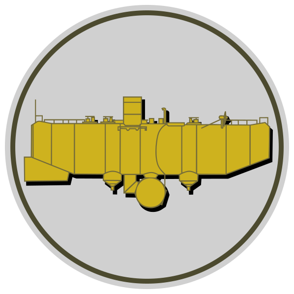

 

# Bathyscaphe

#### Deep immutability (and coming soon: thread-safety) assessment for Java objects

 
The Bathyscaphe logo, a line drawing of <b><i>bathyscaphe Trieste</i></b> 
by Mike Nakis, based on art found at <a href="https://bertrandpiccard.com/3-generations/jacques-piccard">bertrandpiccard.com</a> 

## Description

Bathyscaphe is a java library that can inspect objects at runtime and assert that they are immutable.

For an explanation of what problem it solves, why it is even a problem, why it works where alternatives fail, etc. see the post on my blog which introduces Bathyscaphe and explains what it is: [michael.gr - Bathyscaphe](https://blog.michael.gr/2022/05/bathyscaphe.html)

Bathyscaphe consists of 4 modules:

1. **bathyscaphe-claims** contains annotations that you can add to your classes to aid immutability assessment. For example, if you have a lazily initialized field, and you want to promise that it will behave as if it was `final` even though you cannot declare it as `final`, you can annotate that field as `@Invariable.` Thus, if your class meets all other requirements for immutability, it will be assessed as immutable despite containing a non-final field. Most client code is expected to make use of only this module of bathyscaphe. The jar file is microscopic, since it contains no code, only a few definitions.
1. **bathyscaphe** is the core immutability assessment library. A software system is likely to invoke this library only from a few places, where immutability needs to be ascertained. For example, a custom `HashMap` class might contain a call to bathyscaphe, to ascertain that keys added to it are immutable. The jar file is very small, of the order of 100 kilobytes.
1. **bathyscaphe-print** provides a single method that generates a detailed human-readable diagnostic text explaining precisely why a particular assessment was issued. It is useful when an object which was intended to be immutable turns out to be mutable, and we would like to know exactly why this happened.
1. **bathyscaphe-test** is, of course, the tests, which are extensive and achieve close to 100% coverage.

## How it works

When assessing whether an object is immutable or not, Bathyscaphe begins by looking at the class of the object, just as a static analysis tool would do. However, for any given class Bathyscaphe can issue not just two, but _three_ possible assessments:

1. Mutable
1. Immutable
1. Provisory

The first two are straightforward: if a class can be conclusively assessed as mutable or immutable, then each instance of that class receives the same assessment, and we are done. However, if a class is assessed as provisory, this means that instances of that class _may and may not_ be immutable, we do not know by just looking at the class, so Bathyscaphe will need to further examine each instance of that class before it can issue a final assessment.

For example, if a class looks immutable in all aspects except that it declares a final field of interface type, Bathyscaphe will issue a provisory assessment for that class, the provision being that on instances of that class, the actual value of that field will need to be assessed, and found to be immutable. 

Note that this yields consistently accurate assessments in cases where static analysis tools fail, because they only examine classes, so when a class contains a field which _might_ be mutable, they have no option but to err to the side of safety and assess the containing class as mutable. 

## How to use
    
### Asserting the immutability of objects

The main thing you are likely to do with Bathyscaphe is this:

	assert Bathyscaphe.objectMustBeImmutableAssertion( myObject );  

If `myObject` is immutable, this will succeed; otherwise, an `ObjectMustBeImmutableException` will be thrown.

Note that the exception thrown will **_not_** be `AssertionError`, because `objectMustBeImmutableAssertion()` never returns `false`; It either returns `true`, or it throws `ObjectMustBeImmutableException`. The benefit of using the `assert` keyword is that the method will not be invoked unless assertions are enabled, which is how Bathyscaphe can boast zero performance overhead on production.

### Adding pre-assessments to your classes

Another thing you are likely to do with Bathyscaphe is this:

	Bathyscaphe.addImmutablePreassessment( EffectivelyImmutableClass.class );

In this example, we have a class which is _effectively immutable_, meaning that it behaves immutably, but strictly speaking it is mutable under the hood, either because it is making use of lazy initialization, or simply because it contains an array. (Arrays in Java are by nature mutable.) One famous class that works exactly like that is `java.lang.String`. So, since we know that the class behaves immutably, we are instructing Bathyscaphe to treat the class as immutable, even though Bathyscaphe would have classified the class as mutable if it was to assess it. 

The `addImmutablePreassessment()` method should be used only on classes that we cannot modify, such as classes found in third-party libraries. For classes that we can modify, we should use one or more of the annotations found in the `bathyscaphe-claims` module.

### Annotating your classes

The `@Invariable` annotation can be used as follows:

    @Invariable private int myLazilyInitializedHashCode;

In this example, we have a non-final `int` field in an otherwise immutable class. The presence of this field would normally cause Bathyscaphe to assess the declaring class as mutable; however, with the `@Invariable` annotation we are promising that this particular field will behave as if it was immutable. Therefore, if the class meets all other requirements for immutability, then Bathyscaphe will assess the class as immutable.

Similarly, the `@InvariableArray` annotation can be used as follows:

    @InvariableArray private final byte[] mySha256Hash;

In this example, we have a field which is final, but it is of array type. Arrays are by definition mutable in Java, so this field would normally cause Bathyscaphe to assess the declaring class as mutable; however, with the `@InvariableArray` annotation we are promising that this particular array will behave as if it was immutable. Therefore, if the class meets all other requirements for immutability, then Bathyscaphe will assess the class as immutable.

Note that `@Invariable` and `@InvariableArray` can be combined.

Also note that it is illegal to use either of these annotations on non-private fields, because a class cannot give any promises about the immutability of fields that may be mutated by other classes.

Also note that with these annotations we are only promising shallow immutability; Bathyscaphe will still perform all the checks necessary in order to guarantee deep immutability. So, for example, if the field was of type `Foo` instead of `int`, or if the array field was an array of `Foo` instead of an array of `int`, then Bathyscaphe would recursively assess the immutability of `Foo` as part of assessing the immutability of the field.
                                           
### Self-assessment

Sometimes the question of whether an object is mutable or immutable can be so complicated, that only the object itself can answer the question for sure. For example, sometimes we write classes that are **_freezable_**, meaning that they begin their life as mutable, so that they can undergo complex initialization, and at some later moment they are instructed to **_freeze_** in-place, thus becoming immutable from that moment on. 

In order to accommodate such cases, the bathyscaphe-claims module defines the `ImmutabilitySelfAssessable` interface. If your class implements this interface, bathyscaphe will be invoking instances of your class, asking them whether they are immutable or not.

### Obtaining diagnostics

It may happen that we intend a certain object to be immutable, but Bathyscaphe determines that it is in fact mutable. In these cases, it would be nice to have an explanation as to exactly why Bathyscaphe issued this assessment, so that we can find where the problem is, and fix it. For this reason, there is a separate module called `bathyscaphe-print` which can create detailed human-readable diagnostics from an `ObjectMustBeImmutableException`.

bathyscaphe-print can be used as follows:

	try
	{
		assert Bathyscaphe.objectMustBeImmutableAssertion( List.of( new StringBuilder() ) );  
	}
	catch( ObjectMustBeImmutableException e )
	{
		AssessmentPrinter.getText( e ).forEach( System.out::println );
	}

The above code will emit the following text to the standard output: 
(Note: the exact text is subject to change.)

    ■ instance of 'java.util.ImmutableCollections.List12' is mutable because index 0 contains mutable instance of 'java.lang.StringBuilder'. (MutableComponentMutableObjectAssessment)
    ├─■ type 'java.util.ImmutableCollections.List12' is provisory because it is preassessed by default as a composite class. (CompositeProvisoryTypeAssessment)
    └─■ instance of 'java.lang.StringBuilder' is mutable because it is of a mutable class. (MutableClassMutableObjectAssessment)
      └─■ class 'java.lang.StringBuilder' is mutable because it extends mutable class 'java.lang.AbstractStringBuilder'. (MutableSuperclassMutableTypeAssessment)
        └─■ class 'java.lang.AbstractStringBuilder' is mutable due to multiple reasons. (MultiReasonMutableTypeAssessment)
          ├─■ class 'java.lang.AbstractStringBuilder' is mutable because field 'value' is mutable. (MutableFieldMutableTypeAssessment)
          │ └─■ field 'value' is mutable because it is not final, and it has not been annotated with @Invariable. (VariableMutableFieldAssessment)
          ├─■ class 'java.lang.AbstractStringBuilder' is mutable because field 'coder' is mutable. (MutableFieldMutableTypeAssessment)
          │ └─■ field 'coder' is mutable because it is not final, and it has not been annotated with @Invariable. (VariableMutableFieldAssessment)
          └─■ class 'java.lang.AbstractStringBuilder' is mutable because field 'count' is mutable. (MutableFieldMutableTypeAssessment)
            └─■ field 'count' is mutable because it is not final, and it has not been annotated with @Invariable. (VariableMutableFieldAssessment)

### Other things worth noting

If you decide to incorporate Bathyscaphe in a project, the first thing you are likely to do is what I did: introduce your own HashMap class which asserts that every key added to it is immutable. In doing so you might discover some bugs in your code, but you will also notice something seemingly strange: Bathyscaphe is preventing you from using reference types as keys, which kind of makes sense because they are in fact mutable, but you have never had any issues with that before, so why is it becoming a problem now?

What is happening is that your reference types do not override `hashCode()`, so they inherit the identity hash-code from `Object`, which remains constant throughout the lifetime of your object, despite the mutations that your object undergoes during its lifetime. So, it has been working, but it has only been working by accident. 

Bathyscaphe is meant to be used precisely in order to avoid accidents, so you cannot keep doing this anymore. From now on, you will have to be using `IdentityHashMap` for reference types, and `HashMap` for value types. 

## Status of the project

The "Technology Readiness Level" (TRL) so-to-speak of the project is "5: Technology validated in lab".

The library works, it appears to be problem-free, and it produces very good results; furthermore, the library has extensive tests that achieve full coverage, and they all pass; however, the only environment in which it is currently being put into use is the author's hobby projects, which is about as good as laboratory use. Bathyscaphe will need to receive some extensive beta testing in at least one commercial-scale environment before it can be considered as ready for general availability.

In the meantime, Bathyscaphe is likely to undergo refactoring, and I do not yet intend to hinder its evolution in the name of maintaining backwards compatibility; therefore, at this early stage, there is a conundrum associated with integrating Bathyscaphe into a project:

- Either you pick a version and you stick to it, in which case you will not be receiving improvements as Bathyscaphe evolves,
- Or you keep upgrading to the latest version of Bathyscaphe, but with every upgrade your code might not compile anymore, and may need modifications to make it compile again.

So, if you decide to try Bathyscaphe in its current state, choose wisely, and use at your own risk.

Note that I have placed as many classes as possible in an "internal" package; it goes without saying that you should never make explicit use of any classes in packages that contain the word "internal" in their name.

## Glossary

Note: some of the glossary terms (i.e. variable / invariable, extensible / inextensible) are introduced in order to mitigate the ambiguities caused by Java's unfortunate decision to reuse certain language keywords (i.e. `final`) to mean entirely different things in different situations. (i.e. a `final` class vs. a `final` field.)

- **_Assessment_** - the result of examining an object or a class to determine whether it is immutable or not. Bathyscaphe contains a hierarchy of assessments, which is divided into a few distinct sub-hierarchies: one for type assessments, one for object assessments, one for field assessments, and one for field value assessments. These hierarchies all share a common ancestor for the sole purpose of constructing assessment trees, where the children of an assessment are the reasons due to which the assessment was issued. Also see **_Type assessment_**, **_Object assessment_**.

- **_Bathyscaphe_** - (/ˈbæθɪskeɪf/ or /ˈbæθɪskæf/) (noun) a free-diving, self-propelled, deep-sea submersible with a crew cabin. Being yellow is not a strict requirement. See [Wikipedia - Bathyscaphe](https://en.wikipedia.org/wiki/Bathyscaphe)

- **_Deep Immutability_** - the immutability of an entire object graph reachable from a certain object, as opposed to the immutability of only that object. It is among the fundamental premises of Bathyscaphe that this is the only type of immutability that really matters. Also see opposite: **_Superficial Immutability_**.

- **_Effectively Immutable_** - classes that behave in an immutable fashion, but under the hood are strictly speaking mutable, due to various reasons, for example because they perform lazy initialization, or because they contain arrays. (Arrays in Java are mutable by nature.) The most famous example of such a class is `java.lang.String`. Note that this definition differs from the one given in "Java Concurrency In Practice" section 3.5.4 "Effectively Immutable Objects", which is not really about objects, but rather about the **_treatment_** of objects: the book talks about situations where very mutable objects (for example `java.util.Date`) are being passed around between threads, but the threads refrain from mutating them, so all is good. This sounds like catastrophe waiting to happen, and Bathyscaphe exists precisely in order to prevent programmers from doing things like that.    

- **_Extensible class_** - a class that may be sub-classed (extended.) Corresponds to the absence of the language keyword `final` in the class definition. Also see opposite: **_Inextensible Class_**.

- **_Freezable class_** - a class which begins its life as mutable, so that it can undergo complex initialization, and is at some moment instructed to freeze in-place, thus becoming immutable from that moment on. For more information see the relevant appendix in the introductory blog post: [michael.gr - Bathyscaphe](https://blog.michael.gr/2022/05/bathyscaphe.html)

- **_Inextensible Class_** - a class that may not be sub-classed (extended.) Corresponds to the presence of the language keyword `final` in the class definition. Also see opposite: **_Extensible Class_**.

- **_Invariable Field_** - a field that cannot be mutated. Corresponds to the presence of the language keyword `final` in the field definition. Note that invariability here refers only to the field itself, and is entirely without regards to whether the object referenced by the field is immutable or not. Also see opposite: **_Variable Field_**.

- **_Object Assessment_** - represents the result of examining an instance of a class (an object) to determine whether it is immutable or not. One of the fundamental premises of Bathyscaphe is that we must assess objects for immutability because quite often the assessment of types is inconclusive. Bathyscaphe has one assessment to express that an object is immutable, but an entire hierarchy of assessments for all the different ways in which an object can be mutable, so that it can provide diagnostics as to precisely why an object was assessed as mutable. Also see **_Assessment_**, **_Type Assessment_**.

- **_Shallow Immutability_** - see **_Superficial Immutability_**

- **_Superficial Immutability_** - refers to the immutability of a single object, without regards to the immutability of objects that it references. It is among the fundamental premises of Bathyscaphe that this type of immutability is largely inconsequential. Also see opposite: **_Deep Immutability_**.

- **_Type Assessment_** - represents the result of examining a class to determine whether it is immutable or not. One of the fundamental premises of Bathyscaphe is that type assessment is quite often inconclusive, in which case we must go one step further and assess the immutability of instances of that class. (Objects.) Bathyscaphe has a single assessment to express that a class is immutable, a hierarchy of assessments to represent all the different ways in which a class may be mutable, and another hierarchy of so-called "provisory" assessments to represent all the different ways in which a type eludes assessment, necessitating the further assessment of instances of that type. The information contained in type assessments provides explanations as to why that particular assessment was issued. Furthermore, the information contained in provisory assessments is used by Bathyscaphe as a guide in assessing the immutability of instances. Also see **_Assessment_**, **_Object Assessment_**.

- **_Variable Field_** - a field that is free to mutate. Corresponds to the absence of the language keyword `final` in the field definition. Also see opposite: **_Invariable Field_**.

## Copyright, License, and legal stuff

This is only a summary of the topic. As a summary, it may be incomplete and inaccurate, to the point of being false; so, for the real thing, please see the LICENSE.md file.

All modules of Bathyscaphe are Copyright © 2022, Michael Belivanakis, a.k.a. MikeNakis, michael.gr

Bathyscaphe involves three licenses:

- The **_bathyscaphe-claims_** module is available under the **_MIT License_**, so that Bathyscaphe annotations can be freely used with minimal licensing concerns. See [Wikipedia: MIT License](https://en.wikipedia.org/wiki/MIT_License) but most importantly read the LICENSE.md file.
- **_All other modules_** that comprise Bathyscaphe are available under a dual-license scheme.
  - By default, the license that applies is the **_GNU Affero General Public License_** (GNUAGPL), which is a _viral_, _strong copyleft_ license with an additional provision for _server-side software_. In a nutshell, this means that any software making use of these modules must in turn be open-sourced under the same license, **_even if_** the software would not normally be distributed, as the case is, for example, with server-side software. See [Wikipedia: GNU Affero General Public License](https://en.wikipedia.org/wiki/GNU_Affero_General_Public_License) but most importantly read the LICENSE.md file. 
  - Developers who do not wish to be bound by the limitations of GNUAGPL because they do not want to publish their source code can purchase from the author a **_Bathyscaphe Alternative Terms Commercial License_** (BATCL) for a small fee. Payment is done simply and quickly, via PayPal. Please see the LICENSE.md file.

### Instructions for purchasing a BATCL license

- Send money via PayPal
  - Recipient's e-mail address: paypal@michael.gr
  - Amount: 128.00
  - Currency: EUR
  - Payment reference ("What's this payment for?"): please enter the following information:
    - your e-mail address (otherwise we cannot contact you!)
    - the name of the software you are purchasing a license for, i.e. "Bathyscaphe"
    - the version number that you want to license, as it appears in the maven coordinates.
  - Your shipping address: make sure your legal address is selected.
- As soon as we receive the fee, you are licensed.

## Contacting the author

The author's e-mail address can be found on the sidebar of his blog: https://blog.michael.gr.

## Coding style

When I write code as part of a team of developers, I use the teams' coding style.  
But when I write code for myself, I use _**my very own™**_ coding style.

More information: [michael.gr - On Coding Style](https://blog.michael.gr/2018/04/on-coding-style.html)

## Contributions

### Merge Requests:
- If you would like to contribute to Bathyscaphe by means of a Merge Request, please contact me first, because I will need to ask you to assign the copyright of your contribution to me, or to grant me a permissive license on your contribution. Things would otherwise become terribly complicated due to the dual-license scheme of Bathyscaphe. This means that I will ask you to agree to a **_Contributor License Agreement_** (CLA) which will probably be something like the [MongoDB Contributor Agreement](https://www.mongodb.com/legal/contributor-agreement), but I have yet to draft that document.

### Legal:
- Legal help would be greatly appreciated, since all this licensing business is terribly complicated to me.

### Open-source advice:
- If you are an experienced open-source contributor, your advice and mentorship would be greatly appreciated.

### Sponsorship:
- If you would like to fund me to continue developing Bathyscaphe, or if you would like to see a .Net version of Bathyscaphe sooner rather than later, you can bestow me with large sums of money; that's always appreciated.

## Poor man's issue and TODO tracking

TODO: add thread-safety assessment. A class is thread-safe if:

- It has been annotated with @ThreadSafe.
- It consists of fields that are either immutable, or invariable and in turn of a thread-safe class, or annotated as @ThreadSafe.

TODO: possibly introduce an `@Immutable` annotation (looking for it by simple name, thus honoring it regardless of package,) and treat any class annotated as such as immutable without analyzing it. The idea behind this is that if the developer already has a static analysis tool, then that tool can make sure that classes marked as `@Immutable` are in fact immutable, so that Bathyscaphe does not have to repeat the checks. Be sure to include big disclaimers that the use of the `@Immutable` annotation bypasses Bathyscaphe, so it should only be used if the developer already has other means of statically ascertaining immutability.

TODO: possibly rename 'claims' to 'promises'?

TODO: reduce the size of the assessment hierarchy by replacing some leaf classes with parameters to their common base class.

TODO: fix some TODOs in the code.

TODO: Add sealed class analysis -- This may allow an otherwise provisory field to be assessed as immutable, if it is of extensible type when that extensible type belongs to a sealed group of which all member-classes have been determined to be immutable.

TODO: the actual types of generic arguments of fields can be discovered using reflection; therefore, it might be possible in some cases to conclusively assess a collection field as immutable if the field is invariable, the collection is unchangeable, and the element type of the collection is immutable.

TODO: possible bug: how will assessment go if an object has provisory fields and is also iterable?

TODO: the @InvariableArray annotation might benefit from an integer parameter indicating the number of dimensions for which invariability is promised, so that we can declare an invariable array of invariable arrays, etc.

<strike>TODO:</strike> add a quick check for records -- No, actually, this will not buy us anything, because a record may contain mutable members. Come to think of it, if records allow mutable members, then what is the point in records?

<strike>TODO:</strike> use bytecode analysis to determine whether a class mutates a field outside its constructor. This may alleviate the need for invariability annotations in some cases. -- No, actually, this will gain us very little, because fields that are only mutated within constructors are usually declared as final anyway; it is bad practice to not declare them as final. Fields that are not declared final are typically so because they are in fact mutated outside the constructor. (For example, the cached hashcode in `java.lang.String`.) The only thing that this would buy us is detection of invariable array fields without the need to annotate them with `@InvariableArray`, but this is a marginal benefit. (Who uses arrays anyway?)

<strike>TODO:</strike> add @Pure method annotation and use bytecode analysis to make sure it is truthful. Then, assess interfaces as immutable if they consist of nothing but pure methods. -- No, actually, this will buy us nothing, because purity essentially is unmodifiability, not immutability. Furthermore, purity does not even imply thread-safety: a pure function may attempt to read memory that is concurrently written by another function, with disastrous consequences. What might buy us something is asserting a combination of purity and co-coherence, but I still need to think about that, and in any case, it should probably be the subject of some other module.
